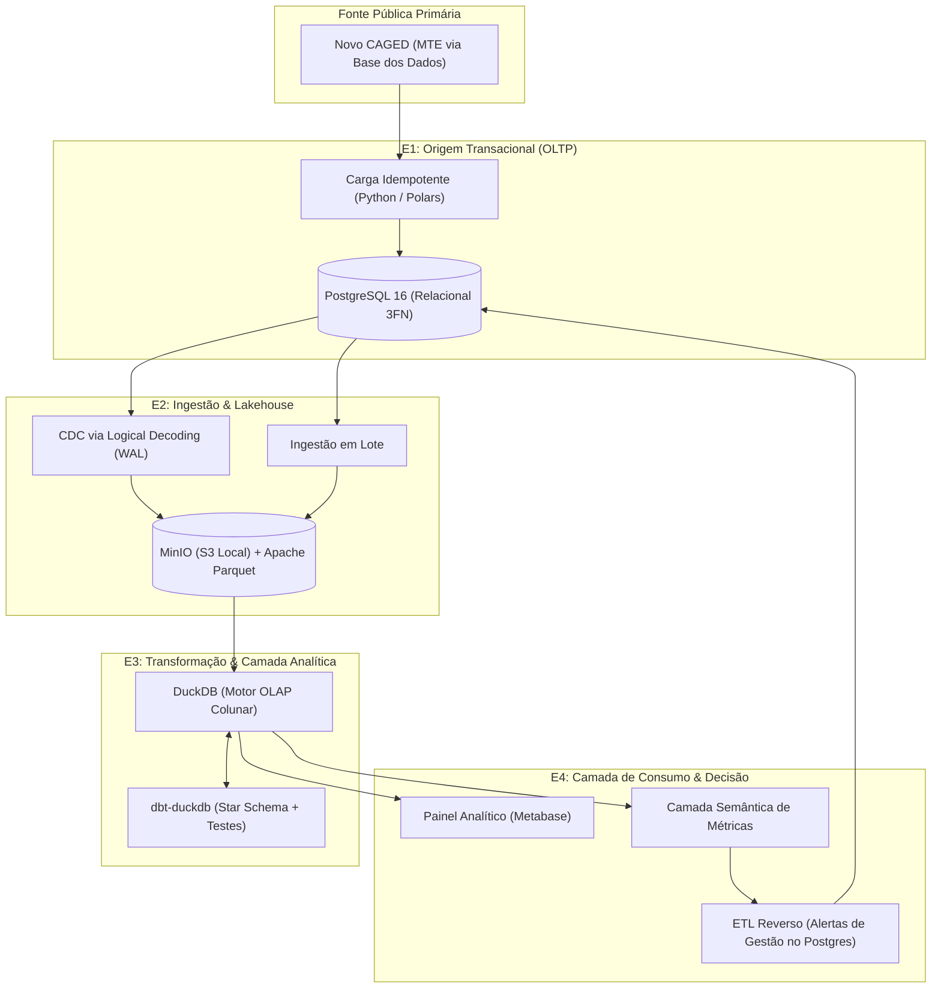

# Arquitetura da Plataforma METRA

O **METRA** foi projetado para cobrir integralmente o ciclo de vida do dado, do sistema transacional à decisão gerencial, com **100% de tecnologias livres** orquestradas localmente via **Docker Compose**.

---

## Visão Geral do Pipeline

---

## Roteiro Incremental das 4 Entregas

### E1 - Fonte Transacional Modelada e Populada (Semana 7)

- **Foco:** Criação do banco OLTP de origem representando o sistema transacional gerador das movimentações.
- **Tecnologia:** **PostgreSQL 16**.
- **Requisitos:** Esquema normalizado (3FN) com constraints explícitas (`PRIMARY KEY`, `FOREIGN KEY`, `NOT NULL`, `CHECK`), migrações versionadas a partir de banco vazio e carga automatizada sem intervenção manual.
- **Decisão Arquitetural:** Esquema _insert-only_ com preservação de histórico vs. sobrescrita com _update_.

### E2 - Ingestão em Lote e Captura de Mudanças (Semana 10)

- **Foco:** Extração do dado da origem transacional e envio para o armazenamento analítico em formato aberto por dois caminhos complementares:
  1. _Lote:_ Extração histórica de grandes blocos de movimentações.
  2. _CDC (Change Data Capture):_ Captura de mutações cadastrais de estabelecimentos e novos registros via leitor de WAL do PostgreSQL.
- **Tecnologia:** **MinIO** para simulação de bucket S3 local e **Apache Parquet** para armazenamento colunar compactado e particionado (`ano/mes/uf`).

### E3 - Camada Analítica Transformada, Testada e Orquestrada (Semana 13)

- **Foco:** Modelagem analítica dimensional voltada a responder às 5 perguntas de gestão.
- **Tecnologia:** **DuckDB** como motor vetorizado OLAP e **dbt-duckdb** para orquestração de transformações em SQL (camadas staging, intermediate e marts dimensionais).
- **Qualidade:** Testes automatizados de unicidade, integridade referencial e limites aceitáveis para métricas salariais. Tratamento de entidades que mudam de estado via _Slowly Changing Dimensions_ (SCD Tipo 2).

### E4 - Plataforma Completa, Governada e Defendida (Semana 16)

- **Foco:** Disponibilização para tomada de decisão e fechamento do ciclo.
- **Tecnologia:** **Metabase** para dashboards interativos com visualizações temporais e geográficas; camada semântica para padronização das métricas de negócio (taxa de rotatividade, saldo de postos, remuneração média real).
- **ETL Reverso:** Pipeline que processa agregados analíticos e devolve indicadores críticos (ex.: alerta de contração aguda em determinado setor no DF) para a tabela de eventos operacionais do PostgreSQL.
- **Governança & LGPD:** Rastreabilidade de linhagem e conformidade de privacidade com mascaramento de dados sensíveis de trabalhadores.
