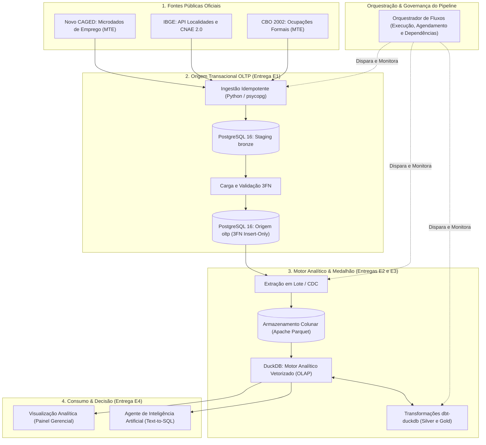

# Arquitetura da Plataforma METRA

O **METRA** (Monitoramento e Engenharia de dados do TRAbalho) foi projetado para cobrir o ciclo de vida completo do dado, partindo de um sistema de origem transacional até a camada analítica de tomada de decisão. 

Em consonância com as deliberações do [ADR 0002](adr/0002-simplificacao-arquitetural-duckdb.md), a arquitetura adota um **desenho pragmático e enxuto**: preserva o rigor relacional do **PostgreSQL 16** para a fonte transacional (OLTP) e emprega o **DuckDB** como motor analítico colunar (OLAP), eliminando intermediários de alta sobrecarga operacional para maximizar a performance e a reprodutibilidade.

---

## Visão Geral do Pipeline

```mermaid
flowchart TD
    subgraph S0["1. Fontes Públicas Oficiais"]
        A1["Novo CAGED: Microdados de Emprego (MTE)"]
        A2["IBGE: API Localidades e CNAE 2.0"]
        A3["CBO 2002: Ocupações Formais (MTE)"]
    end

    subgraph S1["2. Origem Transacional OLTP (Entrega E1)"]
        B1["Ingestão Idempotente (Python / psycopg)"]
        B2[("PostgreSQL 16: Staging bronze")]
        B3["Carga e Validação 3FN"]
        B4[("PostgreSQL 16: Origem oltp (3FN Insert-Only)")]
    end

    subgraph S2["3. Motor Analítico & Medalhão (Entregas E2 e E3)"]
        C1["Extração em Lote / CDC"]
        C2[("Armazenamento Colunar (Apache Parquet)")]
        C3["DuckDB: Motor Analítico Vetorizado (OLAP)"]
        C4["Transformações dbt-duckdb (Silver e Gold)"]
    end

    subgraph S3["4. Consumo & Decisão (Entrega E4)"]
        D1["Visualização Analítica (Painel Gerencial)"]
        D2["Agente de Inteligência Artificial (Text-to-SQL)"]
    end

    subgraph S_ORQ["Orquestração & Governança do Pipeline"]
        O1["Orquestrador de Fluxos (Execução, Agendamento e Dependências)"]
    end

    A1 & A2 & A3 --> B1 --> B2 --> B3 --> B4
    B4 --> C1 --> C2 --> C3
    C3 <--> C4
    C3 --> D1 & D2

    O1 -. "Dispara e Monitora" .-> B1
    O1 -. "Dispara e Monitora" .-> C1
    O1 -. "Dispara e Monitora" .-> C4
```

---

## O Papel da Orquestração no Pipeline

O orquestrador atua como o **maestro** da plataforma de dados: é o componente responsável por gerenciar a ordem de execução das tarefas, monitorar o sucesso de cada etapa, realizar retentativas automáticas em caso de falha e garantir que transformações dependentes só iniciem após a conclusão dos estágios anteriores.

### Onde o Orquestrador atua:
1. **Agendamento da Ingestão:** Dispara as rotinas de extração de novos lotes de dados públicos com base na periodicidade de publicação oficial;
2. **Controle de Dependências:** Garante que as tabelas de referência (IBGE e CBO) sejam populadas antes da carga transacional do CAGED;
3. **Disparo do Motor Analítico:** Aciona a extração para Parquet e as transformações dbt-duckdb das camadas Silver e Gold assim que o banco transacional é atualizado;
4. **Monitoramento e Alertas:** Registra métricas de tempo de execução e envia notificações caso ocorra inconsistência em testes de qualidade.

### Evolução da Orquestração no Projeto:
- **Entrega E1 (Atual):** A orquestração é realizada localmente de forma determinística pelo script coordenador `executar_pipeline.py`, garantindo reprodutibilidade em comando único sem adicionar containers pesados;
- **Entrega E3 (Camada Transformada e Orquestrada):** Formalização da ferramenta de orquestração do pipeline. Para evitar o peso excessivo de soluções corporativas tradicionais como o Apache Airflow (que requer 4 containers dedicados e consome mais de 2 GB de RAM), a Squad avaliará alternativas modernas e leves como **Dagster**, **Prefect** ou **Mage**, integradas diretamente ao ecossistema Python e dbt-duckdb.

---

## Roteiro Incremental das 4 Entregas

### E1: Fonte Transacional Modelada e Populada (Semana 7)

- **Foco:** Criação e carga do banco de dados transacional de origem (OLTP), simulando o ambiente de produção onde as contratações e demissões são registradas no mundo real.
- **Tecnologia:** **PostgreSQL 16**.
- **Fontes Oficiais Integradas:**
  1. *Novo CAGED (MTE):* Microdados de movimentações formais no Centro-Oeste (DF, GO, MT, MS), de 2023 a 2026, com amostra representativa auditada e balanceada de 49.178 registros versionada (< 5 MB).
  2. *IBGE Localidades & CNAE:* API pública para enriquecimento de municípios e subclasses econômicas.
  3. *CBO 2002 (MTE):* Tabela oficial de ocupações e títulos profissionais.
- **Modelagem 3FN e Padrão Insert-Only:** Estrutura relacional na Terceira Forma Normal (`oltp.municipio`, `oltp.cbo_2002`, `oltp.cnae_secao`, `oltp.cnae_subclasse`, `oltp.movimentacao`) com constraints rígidas (`PRIMARY KEY`, `FOREIGN KEY`, `NOT NULL`, `CHECK`). O padrão *insert-only* trata cada movimentação como fato imutável, preservando o histórico integral para o cálculo exato de rotatividade e saldo líquido.
- **Decisão Arquitetural:** Documentada formalmente no [ADR 0001](adr/0001-modelagem-sistema-origem.md).

### E2: Ingestão em Lote e Armazenamento Colunar (Semana 10)

- **Foco:** Extração do histórico da origem transacional e armazenamento em formato colunar aberto para alimentar o processamento analítico.
- **Estratégia:** Extração dos dados do PostgreSQL gerando arquivos **Apache Parquet** particionados por período e localização (`ano/mes/sigla_uf`).
- **Simplificação Adotada ([ADR 0002](adr/0002-simplificacao-arquitetural-duckdb.md)):** Armazenamento em arquivos Parquet locais e otimizados, eliminando a dependência obrigatória de emuladores pesados de nuvem (como MinIO) e reduzindo a sobrecarga contínua de memória RAM.

### E3: Camada Analítica, Modelo Medalhão e dbt (Semana 13)

- **Foco:** Modelagem analítica dimensional (Star Schema) e aplicação da arquitetura medalhão com o **DuckDB**.
- **Tecnologia:** **DuckDB** como motor vetorizado colunar em conjunto com **dbt-duckdb** para transformações SQL modulares e testáveis.
- **Camadas Analíticas:**
  - *Bronze Analítico:* Leitura direta dos arquivos Parquet extraídos da origem;
  - *Silver:* Limpeza, deduplicação, padronização e cruzamento com as tabelas de referência de municípios e ocupações;
  - *Gold:* Métricas agregadas e marts dimensionais prontos para responder à pergunta de gestão (saldo líquido por município, disparidade salarial capital versus interior e médias por setor econômico).
- **Qualidade de Dados:** Testes automatizados de unicidade, integridade referencial e limites aceitáveis de remuneração.

### E4: Camada de Consumo, Decisão e Governança (Semana 16)

- **Foco:** Disponibilização dos dados para tomada de decisão gerencial, fechamento do ciclo de dados e governança.
- **Estratégia Dupla de Consumo:**
  1. *Painel Gerencial:* Visualizações e gráficos interativos para acompanhamento dos indicadores do mercado de trabalho formal;
  2. *Agente de Inteligência Artificial:* Interface em linguagem natural (Text-to-SQL) conectada ao DuckDB, permitindo consultas dinâmicas e análises preditivas/prescritivas para gestores públicos.
- **Governança & LGPD:** Rastreabilidade de linhagem e conformidade de privacidade conforme estabelecido na [Política de Uso de IA](uso-de-ia.md).
