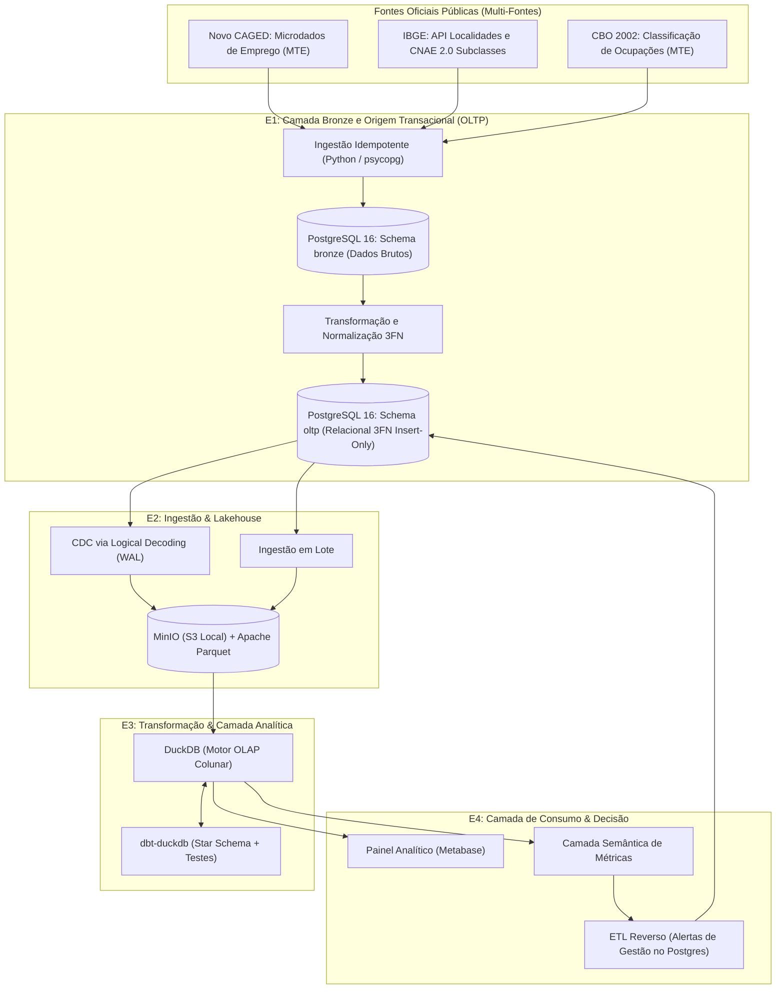

# Arquitetura da Plataforma METRA

O **METRA** (Monitoramento e Engenharia de dados do TRAbalho) foi projetado para cobrir integralmente o ciclo de vida do dado, do sistema transacional à decisão gerencial, com **100% de tecnologias livres** orquestradas localmente via **Docker Compose**.

---

## Visão Geral do Pipeline

```mermaid
flowchart TD
    subgraph S0["Fontes Oficiais Públicas (Multi-Fontes)"]
        A1["Novo CAGED: Microdados de Emprego (MTE)"]
        A2["IBGE: API Localidades e CNAE 2.0 Subclasses"]
        A3["CBO 2002: Classificação de Ocupações (MTE)"]
    end

    subgraph S1["E1: Camada Bronze e Origem Transacional (OLTP)"]
        B1["Ingestão Idempotente (Python / psycopg)"]
        B2[("PostgreSQL 16: Schema bronze (Dados Brutos)")]
        B3["Transformação e Normalização 3FN"]
        B4[("PostgreSQL 16: Schema oltp (Relacional 3FN Insert-Only)")]
    end

    subgraph S2["E2: Ingestão & Lakehouse"]
        C1["CDC via Logical Decoding (WAL)"]
        C2["Ingestão em Lote"]
        C3[("MinIO (S3 Local) + Apache Parquet")]
    end

    subgraph S3["E3: Transformação & Camada Analítica"]
        D1["DuckDB (Motor OLAP Colunar)"]
        D2["dbt-duckdb (Star Schema + Testes)"]
    end

    subgraph S4["E4: Camada de Consumo & Decisão"]
        E1["Painel Analítico (Metabase)"]
        E2["Camada Semântica de Métricas"]
        E3["ETL Reverso (Alertas de Gestão no Postgres)"]
    end

    A1 & A2 & A3 --> B1 --> B2 --> B3 --> B4
    B4 --> C1 & C2 --> C3
    C3 --> D1 <--> D2
    D1 --> E1 & E2
    E2 --> E3 --> B4
```

---

## Roteiro Incremental das 4 Entregas

### E1: Fonte Transacional Modelada e Populada (Semana 7)

- **Foco:** Criação do banco OLTP de origem representando o sistema transacional gerador das movimentações, alimentado a partir da camada Bronze multi-fontes.
- **Tecnologia:** **PostgreSQL 16**.
- **Multi-Fontes Oficiais:**
  1. *Novo CAGED (MTE):* Microdados de admissões e desligamentos formais no Centro-Oeste (DF, GO, MT, MS), de 2023 a 2026 (+14,7 milhões de linhas ou amostra representativa de 49 mil linhas).
  2. *IBGE Localidades & CNAE:* API REST pública de municípios e subclasses econômicas para padronização espacial e setorial.
  3. *CBO 2002 (MTE):* Base oficial de ocupações e títulos profissionais do mercado de trabalho formal.
- **Requisitos 3FN e Padrão Insert-Only:** Esquema normalizado na Terceira Forma Normal (`oltp.municipio`, `oltp.cbo_2002`, `oltp.cnae_secao`, `oltp.cnae_subclasse`, `oltp.movimentacao`) com constraints explícitas (`PRIMARY KEY`, `FOREIGN KEY`, `NOT NULL`, `CHECK`), migrações versionadas a partir de banco vazio e carga automatizada sem intervenção manual.
- **Decisão Arquitetural:** Padrão estritamente *insert-only* baseado em eventos imutáveis de movimentação em vez de CRUD destrutivo, permitindo calcular rotatividade e sazonalidade históricas com fidelidade.

### E2: Ingestão em Lote e Captura de Mudanças (Semana 10)

- **Foco:** Extração do dado da origem transacional e envio para o armazenamento analítico em formato aberto por dois caminhos complementares:
  1. *Lote:* Extração histórica de grandes blocos de movimentações.
  2. *CDC (Change Data Capture):* Captura de mutações cadastrais e novos registros via leitor de WAL do PostgreSQL.
- **Tecnologia:** **MinIO** para simulação de bucket S3 local e **Apache Parquet** para armazenamento colunar compactado e particionado (`ano/mes/uf`).

### E3: Camada Analítica Transformada, Testada e Orquestrada (Semana 13)

- **Foco:** Modelagem analítica dimensional voltada a responder às perguntas de gestão do mercado de trabalho no Centro-Oeste.
- **Tecnologia:** **DuckDB** como motor vetorizado OLAP e **dbt-duckdb** para orquestração de transformações em SQL (camadas staging, intermediate e marts dimensionais).
- **Qualidade:** Testes automatizados de unicidade, integridade referencial e limites aceitáveis para métricas salariais. Tratamento de entidades que mudam de estado via *Slowly Changing Dimensions* (SCD Tipo 2).

### E4: Plataforma Completa, Governada e Defendida (Semana 16)

- **Foco:** Disponibilização para tomada de decisão e fechamento do ciclo.
- **Tecnologia:** **Metabase** para dashboards interativos com visualizações temporais e geográficas; camada semântica para padronização das métricas de negócio (taxa de rotatividade, saldo de postos, remuneração média real).
- **ETL Reverso:** Pipeline que processa agregados analíticos e devolve indicadores críticos para a tabela de eventos operacionais do PostgreSQL.
- **Governança & LGPD:** Rastreabilidade de linhagem e conformidade de privacidade com mascaramento de dados sensíveis de trabalhadores.
