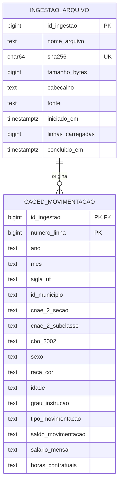

# Camada Bronze (Dados Brutos)

A camada bronze é a primeira parada persistida dos dados no **METRA**: os CSVs do Novo CAGED exportados do BigQuery são carregados **sem nenhum tratamento** no PostgreSQL 16, no schema `bronze`. Tudo o que vem depois (modelo 3FN da E1, Parquet da E2, Star Schema da E3) é derivado daqui por SQL, e qualquer número pode ser rastreado até o arquivo e a linha de origem.

---

## Regras da camada

| Regra | Como é garantida |
|---|---|
| **Dado bruto, sem tratamento** | Todas as colunas de negócio são `TEXT`. Nada é convertido, limpo ou descartado. Campo vazio no CSV vira `NULL`, que é como o BigQuery exporta nulos. |
| **Linhagem até a linha** | Cada registro guarda `id_ingestao` (qual arquivo) e `numero_linha` (linha física no arquivo, com o cabeçalho na linha 1). |
| **Idempotência** | O arquivo é identificado pelo SHA-256 do conteúdo. Rodar a carga de novo, ou renomear o arquivo, não duplica nada. |
| **Atomicidade** | Cada arquivo é carregado em uma única transação. Uma falha (linha malformada, queda de conexão) não deixa carga parcial. |
| **Append-only** | A bronze não sofre `UPDATE` nem `DELETE`. Um novo export dos mesmos meses entra como uma nova ingestão, e a camada seguinte escolhe qual usar. |
| **Contrato de esquema** | O cabeçalho do CSV precisa ser exatamente o esperado, e toda linha precisa ter 15 campos. Se não tiver, a carga falha e informa o número da linha. |

---

## Modelo



- **`bronze.ingestao_arquivo`:** controle das cargas, com um registro por arquivo ingerido.
- **`bronze.caged_movimentacao`:** espelho 1:1 do CSV de `basedosdados.br_me_caged.microdados_movimentacao`.
- O esquema é criado pela migração versionada `src/db/migracoes/0001_camada_bronze.sql`, aplicada por `src/db/migrar.py` e registrada em `public.schema_migracoes`.

---

## Como executar

```bash
# 1. Colocar os CSVs exportados do BigQuery em data/ (ignorados pelo git)

# 2. Subir o PostgreSQL
docker compose up -d postgres

# 3. Aplicar as migrações e carregar a bronze (tarefa pontual)
docker compose run --rm ingestao-bronze
```

A tarefa pode ser executada quantas vezes for preciso: arquivos já carregados são ignorados. Para carregar um arquivo novo, basta colocá-lo em `data/` e rodar o passo 3 de novo.

Sem Docker (Python 3.9+ e um PostgreSQL acessível):

```bash
pip install -r requirements-pipeline.txt
export PGHOST=localhost PGPORT=5432 PGDATABASE=metra PGUSER=metra PGPASSWORD=metra
python src/db/migrar.py
python src/ingestao/carga_bronze.py
```

---

## Validação da carga

```sql
-- Linhas declaradas pela carga x linhas presentes, e período coberto por arquivo
SELECT a.nome_arquivo,
       a.linhas_carregadas,
       count(*)                                   AS linhas_presentes,
       min(m.ano || '-' || lpad(m.mes, 2, '0'))   AS inicio,
       max(m.ano || '-' || lpad(m.mes, 2, '0'))   AS fim
  FROM bronze.ingestao_arquivo a
  JOIN bronze.caged_movimentacao m USING (id_ingestao)
 GROUP BY 1, 2
 ORDER BY 1;

-- Voltar de um registro suspeito à linha exata do arquivo
SELECT a.nome_arquivo, m.numero_linha, m.*
  FROM bronze.caged_movimentacao m
  JOIN bronze.ingestao_arquivo a USING (id_ingestao)
 WHERE m.salario_mensal = '1000000000000';
```

---

## Medições (2026-09-16)

Recorte: CSVs `bq-results-20260916-*` (Centro-Oeste). Carga executada em um MacBook (Apple Silicon, 10 núcleos, 16 GB RAM), com PostgreSQL 16.2 local e Python 3.9 + psycopg 3.2.13. Os mesmos números foram medidos antes da carga, direto nos CSVs com DuckDB, e conferidos contra o banco depois dela.

### Volume e desempenho

| Arquivo | Período | Linhas | Tamanho | Tempo de carga |
|---|---|---:|---:|---:|
| `bq-results-20260916-012446-…` | 2023-01 a 2024-12 | 9.298.118 | 522 MB | 32,5 s (286 mil linhas/s) |
| `bq-results-20260916-012615-…` | 2025-01 a 2026-01 | 5.454.994 | 306 MB | 21,2 s (258 mil linhas/s) |
| **Total** | | **14.753.112** | **828 MB** | **54 s** |

- Uma segunda execução, sem nada novo a carregar, termina em **0,5 s**.
- Ocupação no PostgreSQL: **1,98 GB**, sendo 1,54 GB de dados e 444 MB do índice da chave primária. Ou seja, cerca de 2,4 vezes o tamanho dos CSVs.
- Distribuição por UF: GO 5,80 M · MT 3,88 M · DF 2,63 M · MS 2,44 M.
- Os dois arquivos não têm nenhum mês em comum.

### Achados para a camada seguinte

A bronze **preserva** tudo abaixo de propósito. O tratamento é responsabilidade da camada seguinte.

| Achado | Volume | Implicação |
|---|---:|---|
| Período termina em **2026-01**, não em 2026-02 | - | O diário da Semana 03 fala em "até fevereiro de 2026". É preciso reexportar fevereiro ou corrigir o recorte documentado. |
| `cbo_2002` com 5 dígitos (ex.: `10105`) | 352 | O zero à esquerda se perdeu no export (CBO tem 6 dígitos). Completar com `lpad(cbo_2002, 6, '0')`. |
| `cnae_2_subclasse` começando com `0` | 1.671.793 | Confirma que tipar como inteiro destruiria o código. |
| Linhas exatamente iguais | 606.842 | Esperado: o CAGED não identifica o trabalhador, então duas admissões de mesmo perfil no mesmo mês são idênticas. **Não deduplicar.** |
| `salario_mensal` < 100 | 251.598 | Distribuídos igualmente entre admissões (125.454) e desligamentos (126.144). Inclui 2.857 registros com `0.01`. Definir a regra de exclusão para médias salariais. |
| `salario_mensal` > 100.000 | 3.866 | Máximo de `1000000000000` (1 trilhão), claramente erro de digitação na origem. |
| Nulos | `salario_mensal` 1.862 · `horas_contratuais` 851 · `idade` 132 · `id_municipio` 13 | Tratar explicitamente. |
| Códigos "não identificado" | `sexo`=9: 52 · `raca_cor`=9: 2.256 · `grau_instrucao`=99: 52 | Mapear para "Não identificado" no dicionário. |
| `cnae_2_secao` = `Z` | 15 | Seção fora da CNAE 2.0, sempre com subclasse `9999999` (setor não identificado). |
| `horas_contratuais` fracionárias (ex.: `51.33`) | - | O tipo analítico precisa ser decimal, não inteiro. |
| Exportadas só 15 colunas | - | Não há indicador de movimentação fora do prazo ou excluída neste export. Confirmar com a query do BigQuery antes de calcular o saldo oficial. |
