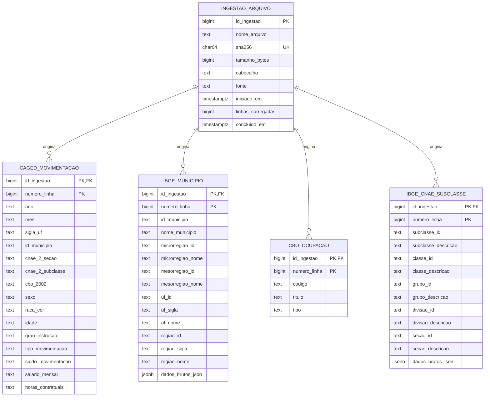

# Camada Bronze (Dados Brutos Multi-Fontes)

A camada bronze é a primeira parada persistida de todas as fontes de dados no **METRA**. Nela, tanto os microdados do Novo CAGED quanto os dados de referência de fontes secundárias oficiais (**IBGE** e **CBO**) são carregados **sem nenhum tratamento** no PostgreSQL 16, no schema `bronze`.

Tudo o que vem depois (modelo transacional 3FN da E1, Parquet da E2, Star Schema da E3) é derivado daqui por transformações controladas, e qualquer registro pode ser rastreado até o arquivo, endpoint e linha de origem.

---

## Fontes Oficiais Integradas na Bronze

| Fonte | Tipo | Endpoint / Arquivo | Descrição | Registros |
|---|---|---|---|---:|
| **Novo CAGED (MTE)** | Microdados Primários | `data/caged_*.csv` | Movimentações mensais de emprego formal (Centro-Oeste, 2023-2026) | 14.753.112 (ou amostra versionada de 49.178) |
| **IBGE Localidades** | API Pública REST | `/api/v1/localidades/municipios` | Municípios oficiais do Brasil, hierarquia de microrregião, UF e região | 5.571 |
| **IBGE CNAE** | API Pública REST | `/api/v2/cnae/subclasses` | Estrutura econômica de subclasses, classes, grupos, divisões e seções | 1.332 |
| **CBO 2002 (MTE)** | Tabela Oficial | `cbo_2002_lista.csv` | Classificação Brasileira de Ocupações com títulos e sinônimos oficiais | 10.345 |

---

## Reprodutibilidade Garantida para Avaliação de Terceiros

Para cumprir rigorosamente o critério de **Carga Reprodutível** da Entrega E1 sem exigir downloads manuais externos:

1. **Execução com Volume Completo:** Se os arquivos pesados de microdados históricos (`caged_2023_2024.csv` e `caged_2025_2026.csv`, totalizando ~828 MB) estiverem presentes na pasta `data/`, o pipeline realiza a carga massiva dos mais de 14,7 milhões de registros.
2. **Execução Automatizada de Terceiros (Fallback Reproduzível):** Caso um avaliador clone o repositório em um ambiente limpo (onde os arquivos de 828 MB são ignorados pelo git), o script `carga_bronze.py` detecta automaticamente a ausência dos arquivos pesados e realiza a ingestão da **amostra representativa versionada** [`data/caged_centro_oeste_amostra.csv`](file:///c:/UnB/BD2/ProjetoIntegrado/data/caged_centro_oeste_amostra.csv) (49.178 linhas, 2,8 MB, cobrindo todos os anos de 2023 a 2026 e as 4 UFs do Centro-Oeste). 

Dessa forma, qualquer terceiro consegue reproduzir a carga completa com um único comando Docker, sem intervenção manual.

---

## Regras da Camada Bronze

| Regra | Como é garantida |
|---|---|
| **Dado bruto, sem tratamento** | Todas as colunas de negócio são `TEXT` ou `JSONB`. Nada é convertido, limpo ou descartado prematuramente. |
| **Linhagem até a linha** | Cada registro guarda `id_ingestao` (qual lote/arquivo) e `numero_linha` (linha física ou índice da carga). |
| **Idempotência** | O conteúdo é identificado pelo hash SHA-256 da carga. Rodar a carga novamente não duplica registros. |
| **Atomicidade** | Cada ingestão é executada em uma única transação. Uma falha de rede não deixa estados parciais. |
| **Append-only** | A camada bronze não sofre `UPDATE` ou `DELETE` operacional. Novas cargas entram como novas ingestões auditáveis. |

---

## Modelo Entidade-Relacionamento da Bronze

O diagrama abaixo mostra a **linhagem por ingestão**. Para entender como o CAGED se liga ao IBGE, à CBO e à CNAE pelos códigos de negócio, consulte [Relacionamento entre as bases](relacionamentos.md), com os pares de campos, as cardinalidades e o diagrama do OLTP.


```mermaid
erDiagram
    INGESTAO_ARQUIVO ||--o{ CAGED_MOVIMENTACAO : "origina"
    INGESTAO_ARQUIVO ||--o{ IBGE_MUNICIPIO : "origina"
    INGESTAO_ARQUIVO ||--o{ CBO_OCUPACAO : "origina"
    INGESTAO_ARQUIVO ||--o{ IBGE_CNAE_SUBCLASSE : "origina"

    INGESTAO_ARQUIVO {
        bigint id_ingestao PK
        text nome_arquivo
        char64 sha256 UK
        bigint tamanho_bytes
        text cabecalho
        text fonte
        timestamptz iniciado_em
        bigint linhas_carregadas
        timestamptz concluido_em
    }

    CAGED_MOVIMENTACAO {
        bigint id_ingestao PK, FK
        bigint numero_linha PK
        text ano
        text mes
        text sigla_uf
        text id_municipio
        text cnae_2_secao
        text cnae_2_subclasse
        text cbo_2002
        text sexo
        text raca_cor
        text idade
        text grau_instrucao
        text tipo_movimentacao
        text saldo_movimentacao
        text salario_mensal
        text horas_contratuais
    }

    IBGE_MUNICIPIO {
        bigint id_ingestao PK, FK
        bigint numero_linha PK
        text id_municipio
        text nome_municipio
        text microrregiao_id
        text microrregiao_nome
        text mesorregiao_id
        text mesorregiao_nome
        text uf_id
        text uf_sigla
        text uf_nome
        text regiao_id
        text regiao_sigla
        text regiao_nome
        jsonb dados_brutos_json
    }

    CBO_OCUPACAO {
        bigint id_ingestao PK, FK
        bigint numero_linha PK
        text codigo
        text titulo
        text tipo
    }

    IBGE_CNAE_SUBCLASSE {
        bigint id_ingestao PK, FK
        bigint numero_linha PK
        text subclasse_id
        text subclasse_descricao
        text classe_id
        text classe_descricao
        text grupo_id
        text grupo_descricao
        text divisao_id
        text divisao_descricao
        text secao_id
        text secao_descricao
        jsonb dados_brutos_json
    }
```

---

## Como Executar

### Execução Integrada via Docker Compose (Recomendado)

```bash
# 1. Subir o PostgreSQL
docker compose up -d postgres

# 2. Executar o pipeline E1 completo (migrações + fontes Bronze + carga OLTP 3FN)
docker compose run --rm ingestao-bronze
```

### Execução Modular Pontual (Scripts Individuais)

Caso deseje executar módulos específicos:

```bash
# Ingestão dos CSVs do CAGED
docker compose run --rm ingestao-bronze python src/ingestao/carga_bronze.py

# Ingestão da API do IBGE (Municípios e CNAE)
docker compose run --rm ingestao-bronze python src/ingestao/carga_ibge.py

# Ingestão da base CBO 2002 (MTE)
docker compose run --rm ingestao-bronze python src/ingestao/carga_cbo.py

# Promoção e normalização para o schema OLTP (3FN)
docker compose run --rm ingestao-bronze python src/ingestao/carga_oltp.py
```

---

## Validação e Auditoria da Carga

```sql
-- Resumo de todas as cargas da camada Bronze registradas
SELECT id_ingestao,
       nome_arquivo,
       linhas_carregadas,
       fonte,
       iniciado_em,
       concluido_em
  FROM bronze.ingestao_arquivo
 ORDER BY id_ingestao;

-- Rastreabilidade de movimentação até o arquivo e linha de origem
SELECT a.nome_arquivo, m.numero_linha, m.id_municipio, m.cbo_2002, m.salario_mensal
  FROM bronze.caged_movimentacao m
  JOIN bronze.ingestao_arquivo a USING (id_ingestao)
 LIMIT 5;
```
