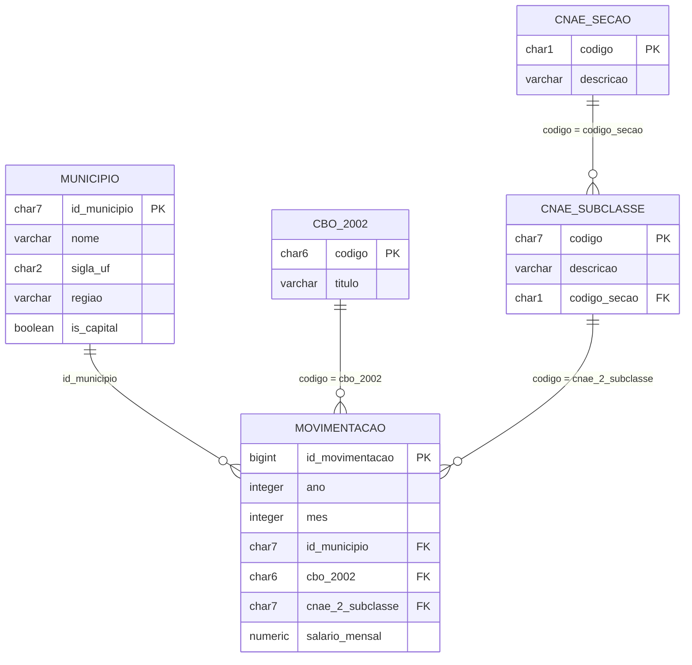

# Relacionamento entre as bases

O **Novo CAGED é a base central**: cada movimentação de admissão ou desligamento informa códigos que permitem consultar três referências. O **IBGE Localidades** identifica o município, a **CBO 2002** identifica a ocupação do trabalhador e o **IBGE CNAE** identifica a atividade econômica. CBO e CNAE descrevem aspectos diferentes: a profissão e a atividade econômica, respectivamente.

## Quais campos ligam as fontes?

Os nomes abaixo são os usados nas tabelas do projeto. O “código do município” é `id_municipio`; o “código CBO” aparece como `cbo_2002` no CAGED e `codigo` na referência CBO.

| Par de tabelas na Bronze | Campo do CAGED | Campo da referência | Informação acrescentada |
|---|---|---|---|
| `bronze.caged_movimentacao` ↔ `bronze.ibge_municipio` | `id_municipio` | `id_municipio` | Nome do município, UF e região; microrregião e mesorregião também estão disponíveis na Bronze. |
| `bronze.caged_movimentacao` ↔ `bronze.cbo_ocupacao` | `cbo_2002` | `codigo` | Título da ocupação. |
| `bronze.caged_movimentacao` ↔ `bronze.ibge_cnae_subclasse` | `cnae_2_subclasse` | `subclasse_id` | Descrição da subclasse e sua hierarquia de atividade econômica. |

Esses pares representam **correspondências de negócio**, não chaves estrangeiras entre as tabelas Bronze. A Bronze preserva os registros de cada fonte, identificados pela chave composta `(id_ingestao, numero_linha)`. O campo `id_ingestao` identifica o lote de origem de cada fonte: ele **não serve para ligar CAGED a IBGE ou CBO**.

A seção econômica também está disponível como `caged_movimentacao.cnae_2_secao` e `ibge_cnae_subclasse.secao_id`. Como uma seção reúne várias subclasses, relacionar movimentações diretamente com todas as subclasses apenas pela seção multiplicaria as linhas. No OLTP, a seção é obtida pela subclasse.

## Como essas ligações ficam no OLTP?

O pipeline carrega as referências em tabelas de domínio com códigos únicos. A tabela `oltp.movimentacao` guarda as chaves estrangeiras para essas tabelas.

| Tabela de origem | Tabela de destino | Condição de ligação (FK → PK) | Cardinalidade |
|---|---|---|---|
| `oltp.movimentacao` | `oltp.municipio` | `movimentacao.id_municipio = municipio.id_municipio` | N:1 |
| `oltp.movimentacao` | `oltp.cbo_2002` | `movimentacao.cbo_2002 = cbo_2002.codigo` | N:1 |
| `oltp.movimentacao` | `oltp.cnae_subclasse` | `movimentacao.cnae_2_subclasse = cnae_subclasse.codigo` | N:1 |
| `oltp.cnae_subclasse` | `oltp.cnae_secao` | `cnae_subclasse.codigo_secao = cnae_secao.codigo` | N:1 |

**N:1** significa que várias movimentações podem apontar para o mesmo município, ocupação ou subclasse. Cada movimentação tem exatamente uma referência de cada tipo, pois suas FKs são `NOT NULL`. Uma referência pode existir sem movimentações associadas.



O diagrama apresenta as relações de negócio do schema `oltp` e um subconjunto dos atributos. A linhagem dos arquivos é apresentada na [Camada Bronze](camada-bronze.md#modelo-entidade-relacionamento-da-bronze).

## Padronização dos códigos e limites da integração

As transformações abaixo refletem a implementação de `src/ingestao/carga_oltp.py`:

| Referência | Transformação da Bronze para o OLTP |
|---|---|
| Município | O código vindo do IBGE é preenchido com zeros à esquerda até 7 caracteres. Na movimentação, `id_municipio` é preservado; nulo ou vazio recebe `9999999` (município não identificado). |
| CBO | Na referência, remove-se o hífen e aceitam-se códigos com 4 a 6 dígitos, preenchidos até 6 caracteres. No CAGED, o código é preenchido até 6 caracteres. Para títulos repetidos, o pipeline agrupa pelo código normalizado e prioriza `tipo = 'Ocupação'`, depois o menor comprimento de título. |
| CNAE | A subclasse é preenchida até 7 caracteres, preservando zeros à esquerda. A seção usa um caractere. O pipeline cadastra a subclasse genérica `9999999` ligada à seção `Z`. |

Por exemplo, `1234-56` na referência CBO passa a `123456`, permitindo a comparação com o código de seis caracteres da movimentação. Trata-se de um exemplo de formato, não de uma ocupação específica.

Os códigos devem ser tratados como identificadores textuais. O pipeline não reconstrói um código municipal de 7 dígitos a partir de um código de 6 dígitos; a origem CAGED precisa fornecer a chave compatível. Um município não vazio e inexistente no domínio é rejeitado pela FK.

Códigos CBO presentes no CAGED e ausentes da referência podem ser cadastrados com título genérico. Subclasses CNAE ausentes podem ser cadastradas como registros administrativos, usando a seção do CAGED ou `Z`; a seção ainda precisa existir para satisfazer a FK. Portanto, **ter correspondência no OLTP não garante que a descrição tenha sido encontrada na fonte oficial**.

Junções diretas na Bronze exigem cuidado: diferentes lotes podem repetir um código, e a CBO pode ter títulos e sinônimos para o mesmo código. Isso pode multiplicar movimentações e distorcer contagens. Para consultas integradas, use as tabelas de domínio do OLTP, cujas PKs garantem um registro por código.

## Exemplo de consulta entre as bases

Esta consulta mostra cada movimentação com seu município, ocupação e atividade econômica. As condições `ON` explicitam os quatro pares de campos apresentados acima.

```sql
SELECT m.id_movimentacao,
       m.ano,
       m.mes,
       mun.nome AS municipio,
       mun.sigla_uf,
       cbo.titulo AS ocupacao,
       sub.descricao AS atividade_economica,
       sec.descricao AS setor_economico,
       m.salario_mensal
  FROM oltp.movimentacao AS m
  JOIN oltp.municipio AS mun
    ON m.id_municipio = mun.id_municipio
  JOIN oltp.cbo_2002 AS cbo
    ON m.cbo_2002 = cbo.codigo
  JOIN oltp.cnae_subclasse AS sub
    ON m.cnae_2_subclasse = sub.codigo
  JOIN oltp.cnae_secao AS sec
    ON sub.codigo_secao = sec.codigo
 ORDER BY m.id_movimentacao
 LIMIT 20;
```

Como as junções usam as PKs das referências e as FKs obrigatórias da movimentação, cada movimentação produz uma linha antes do `LIMIT`. Município permite os recortes geográficos; CNAE permite comparar setores; CBO permite comparar ocupações.

## Rastreabilidade e implementação

`oltp.movimentacao.id_ingestao` tem FK para `bronze.ingestao_arquivo.id_ingestao`. O par `(id_ingestao, numero_linha)` permite localizar a movimentação bruta e tem índice único no OLTP, mas **não há FK composta para `bronze.caged_movimentacao`** na migração atual.

As definições que sustentam esta página estão em:

- [Migração das referências Bronze](https://github.com/unb-bd2-2026-2-grupo-4/ProjetoIntegrado/blob/fix/git-pages-docs/src/db/migracoes/0002_camada_bronze_referencias.sql).
- [Migração do modelo OLTP e suas PKs/FKs](https://github.com/unb-bd2-2026-2-grupo-4/ProjetoIntegrado/blob/fix/git-pages-docs/src/db/migracoes/0003_modelo_transacional_oltp.sql).
- [Transformação e carga Bronze → OLTP](https://github.com/unb-bd2-2026-2-grupo-4/ProjetoIntegrado/blob/fix/git-pages-docs/src/ingestao/carga_oltp.py).
